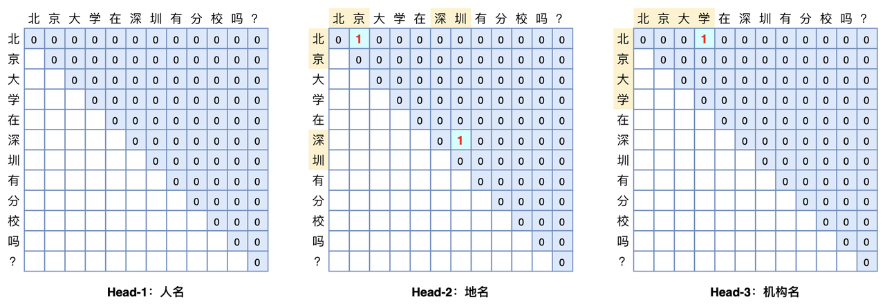

<link rel="stylesheet" href="https://cdn.jsdelivr.net/npm/katex@0.15.1/dist/katex.min.css" integrity="sha384-R4558gYOUz8mP9YWpZJjofhk+zx0AS11p36HnD2ZKj/6JR5z27gSSULCNHIRReVs" crossorigin="anonymous">

  
## 简介

GlobalPointer是一种基于span分类的解码方法。对于任意句子，GlobalPointer构造一个上三角矩阵来遍历所有有效的span，如下图所示，每一个格子对应一个entity span.

暂时假设实体类别只有一个，假设经过encoder（lstm或者bert）后，位置$i$和$j$处的representation为$h_i$和$h_j$，经过全连接层分别得到二者的query向量$q_i$和key向量$k_i$：

$$
\begin{aligned} 
q_i & = W_q h_i + b_q \\
k_i & = W_k h_j + b_k 
\end{aligned}
$$

于是每个span预测为实体的分数$s(i,j)$为：

$$
s(i,j) = q_i^{\top}k_j
$$

但这并非最终形态，GlobalPointer在此基础上融入旋转位置编码（RoPE）机制来显式地给span pair的预测引入相对位置信息。

## 旋转位置编码

对于位置$m$，RoPE会计算出一个正交矩阵$R_m$，将$R_m$与$\bold{q}$相乘便实现对$\bold{q}$进行旋转，如果$\bold{q}$是二维，有：

$$
\boldsymbol{f}(\boldsymbol{q}, m) =\begin{pmatrix}
\cos m\theta & -\sin m\theta\\ \sin m\theta & \cos m\theta
\end{pmatrix} \begin{pmatrix}q_0 \\ q_1\end{pmatrix}
$$

对于高阶偶数维的$\bold{q}$，有：

$$
\scriptsize{\underbrace{\begin{pmatrix} 
\cos m\theta_0 & -\sin m\theta_0 & 0 & 0 & \cdots & 0 & 0 \\ 
\sin m\theta_0 & \cos m\theta_0 & 0 & 0 & \cdots & 0 & 0 \\ 
0 & 0 & \cos m\theta_1 & -\sin m\theta_1 & \cdots & 0 & 0 \\ 
0 & 0 & \sin m\theta_1 & \cos m\theta_1 & \cdots & 0 & 0 \\ 
\vdots & \vdots & \vdots & \vdots & \ddots & \vdots & \vdots \\ 
0 & 0 & 0 & 0 & \cdots & \cos m\theta_{d/2-1} & -\sin m\theta_{d/2-1} \\ 
0 & 0 & 0 & 0 & \cdots & \sin m\theta_{d/2-1} & \cos m\theta_{d/2-1} \\ 
\end{pmatrix}}_{\boldsymbol{\mathcal{R}}_m} \begin{pmatrix}q_0 \\ q_1 \\ q_2 \\ q_3 \\ \vdots \\ q_{d-2} \\ q_{d-1}\end{pmatrix}}
$$

于是以此类推，如果将$\bold{k}$也乘上旋转位置编码，此时span的分数$s(i,j)$就会带有相对位置信息（也就是$\boldsymbol{\mathcal{R}}_{n-m}$）：

$$
(\boldsymbol{\mathcal{R}}_m \boldsymbol{q})^{\top}(\boldsymbol{\mathcal{R}}_n \boldsymbol{k}) =  \boldsymbol{q}^{\top} \boldsymbol{\mathcal{R}}_m^{\top}\boldsymbol{\mathcal{R}}_n \boldsymbol{k} = \boldsymbol{q}^{\top} \boldsymbol{\mathcal{R}}_{n-m} \boldsymbol{k}
$$

> 注意:
>
> $\cal{R}_m^{\top}\cal{R}_n = \cal{R}_{n-m}$是RoPE自带的性质，具体可查看RoPE的理论证明。

## 损失函数的设计

为方便表示，上文一直假设实体类别只有一个。对于$m$个实体类别，句子统一长度为$L$，每个实体类别对应一个头（head），即GlobalPointer的输出张量的shape为$[batch\_size, m, L, L]$. GlobalPointer的损失函数和circle loss类似，对于span分类，可得到如下的损失函数：

$$
\begin{aligned}\log \bigg(1 + \sum \limits_{i\in\Omega_{neg},j \in \Omega_{pos}} e^{s_i-s_j}\bigg)=\log \bigg(1 + \sum \limits_{i\in \Omega_{neg}} e^{s_i}\sum \limits_{j\in \Omega_{pos}} e^{-s_j}\bigg) \end{aligned}
$$

其中$\Omega_{neg}, \Omega_{pos}$分别当前实体类别下的负样例span集合和正样例span集合，由于$log$的递减性以及和max激活函数的近似性，该式会使得非实体span的分数$s_i$小于实体span的分数$s_j$.

但是使用该式子作为损失函数，只能使得实体span的预测分数大于非实体span的预测分数，再加上当前句子包含实体的个数是未知的，无法从$\frac{L*L}{2}$个span中选出所有实体span，一个直观的解决办法是卡一个阈值。

GlobalPointer引入一个额外的实体类别$O$，并规定所有实体span中预测分数大于0，所有非实体span的预测分数小于0，于是便在$e^{s_i-s_j}$的基础上再添加$e^{s_i-s_0}$和$e^{s_0-s_j}$两项（$s_0$等于0）：

$$
\begin{aligned}\begin{aligned} &\log \left(1 + \sum\limits_{i\in\Omega_{neg},j\in\Omega_{pos}} e^{s_i-s_j}+\sum\limits_{i\in\Omega_{neg}} e^{s_i-s_0}+\sum\limits_{j\in\Omega_{pos}} e^{s_0-s_j}\right)\\ =&\log \left(e^{s_0} + \sum\limits_{i\in\Omega_{neg}} e^{s_i}\right) + \log \left(e^{-s_0} + \sum\limits_{j\in\Omega_{pos}} e^{-s_j}\right)\\ \end{aligned}\end{aligned}
$$

把$s_0=0$代入上式得到：

$$
\begin{aligned}
\log \bigg( 1 + \sum_{i \in \Omega_{neg}} e^{s_i} \bigg) + \log \bigg(1 + \sum \limits_{j \in \Omega_{pos}} e^{-s_j}\bigg)
\end{aligned}
$$

## 实验

用PyTorch复现GlobalPointer，在多个数据集上验证GlobalPointer的成绩，结果如下：

||MSRA *dev*|Cluener|Weibo|
|-|-|-|-|
|Bert|95.92|*TBD*|*TBD*|
|Bert-CRF|||
|Bert-GlobalPointer|**96.99**|*TBD*|*TBD*|

---

[^1]: 为了保证复现的正确性，我们在相同输入下对比了两个版本的结果，不考虑Tensorflow默认浮点类型为Float64而PyTorch默认浮点类型为Float32带来的影响，二者结果一致。